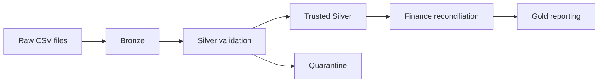

# Architecture Diagram

This is the required high-level pipeline diagram. It is intentionally kept simple.

Bronze preserves the source data with traceability information.

Silver standardizes and validates the data and checks relationships between the five entities.

Invalid records go to quarantine with a validation reason instead of disappearing.

Gold uses trusted Silver data to produce Finance reconciliation, trusted revenue and reporting outputs.
